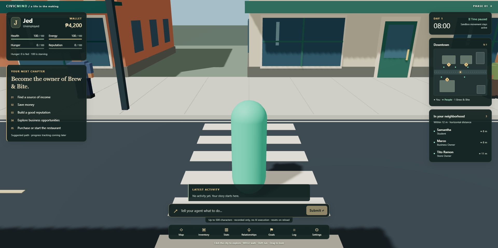

# UI + QA foundation handoff

## Delivery

Branch: `codex/ui-foundation`. Worktree:
`D:\Civic Mind\civicmind\.worktrees\ui-foundation`.
Fetched base: `a23f84545384faa80d2be17e4ff512c1617fda6b` (World integration).
Main was clean and was not edited. This branch awaits Lead review/integration.



The HUD displays Jed's shared identity, occupation, peso-formatted whole credits,
four stats, active goal, day/time, nearby people and world-derived map. Hunger is
explicitly 0 fed / 100 starving. Missing ownership subtasks get five labeled
suggested steps; real GoalTask records always take priority. No task completion is
inferred from commands. Runtime activity starts empty, with no invented encounters.

Map, Inventory, Stats, Relationships, Goals, Log and Settings all open native modal
dialogs with Escape and focus restoration. Empty feature states explain current
limits. Commands validate 1–500 trimmed characters and record ActivityEvent data;
overlong text remains editable and no AI action occurs. The log keeps the latest
100 local events. Settings affect the HUD immediately and reset on reload.

## Files and exports

- `src/ui/GameHUD.tsx`: main composed overlay and navigation contents.
- `src/ui/HudPanels.tsx`: `PlayerHUD`, `GoalPanel`, `ActivityLog`, `NearbyNPCPanel`.
- `src/ui/MiniMap.tsx`: `MiniMap`, using pure world data and live observations.
- `src/ui/CommandInput.tsx`: `CommandInput`, callback-based submission boundary.
- `src/ui/HudNavigation.tsx`: `HudNavigation`, `HudDialog`, `HudScreen` type.
- `src/ui/DebugPanel.tsx`: `DebugPanel`, sampled browser frame cadence and observations.
- `src/ui/useDebugToggle.ts`: guarded Backquote shortcut; ignores text/IME/modifiers/dialogs.
- `src/ui/useHUDSession.ts`: `useHUDSession`, bounded observations and local activity.
- `src/ui/hudModel.ts`: pure currency/time, goal, nearby, command/event and map helpers.
- `src/ui/hudModel.test.ts`, `src/ui/HudPanels.test.ts`: 20 new contract/render tests.
- `src/ui/hud.css`: scoped responsive HUD styles; no large framework or animation loop.
- `src/ui/index.ts`: public component/hook exports and `GameHUDProps`.
- `docs/images/ui-foundation-preview.png`: captured production HUD/scene preview.
- Removed obsolete `src/ui/FoundationOverlay.tsx`.
- Cross-owner edits: `src/App.tsx` connects callbacks and replaces the temporary
  overlay; `PROJECT_STATUS.md` and design/handoff docs record this delivery.
  No changes to game rendering, player, world, NPCs, provider, shared types, package
  files, lockfile or global CSS.

## Integration

App wiring is included and can be reviewed directly. For manual composition, place
the hook under the existing GameProvider and mount the HUD beside the existing
scene. Memoize the scene so observation updates do not rerender its composition:

```tsx
const FoundationScene = memo(lazy(() => import('./game/rendering/FoundationScene')))

function GameView() {
  const session = useHUDSession()
  return <main className="app">
    <SceneBoundary>
      <Suspense fallback={<p>Loading scene…</p>}>
        <FoundationScene
          onPlayerSnapshot={session.onPlayerSnapshot}
          onNPCSnapshot={session.onNPCSnapshot}
        />
      </Suspense>
    </SceneBoundary>
    <GameHUD {...session} />
  </main>
}
```

`useHUDSession` exposes `playerSnapshot`, `npcs`, `events`, `liveNPCs`, stable
`onPlayerSnapshot`, `onNPCSnapshot`, and `appendEvent(event: Readonly<ActivityEvent>)`.
Future producers can call appendEvent with a unique ID, actual game-minute timestamp,
kind/message and optional actor ID. The helper copies the incoming event and ignores
duplicate IDs. This API is local UI session history, not a persistence/domain action.
Agree a tested explicit provider mutation with Lead before promoting it to game state.

Consumed contracts: PlayerState/CharacterStats, GameTime, Goal/GoalTask,
ActivityEvent, NPCState (name/occupation/position), Position, inventory and directed
relationships, plus existing PlayerSnapshot. Domain imports are type-only. Deeply
read-only provider data is accepted without casts or mutation.

World adapter imports `WORLD_BOUNDS`, `CITY_BUILDINGS`, `WORLD_LANDMARKS` from the
pure `cityBlockData` module and `getNearbyNPCs` from `npcSimulation`. No renderer
barrel import is added to the eager HUD bundle. XZ proximity uses an inclusive 12 m
radius; distances are approximate integer meters. The map uses north/-Z upward,
numbered destination entrances, building footprints and five named observation dots.
The background road is schematic and matches the single east–west street; it is not
a navigation mesh. Gameplay alone continues to own camera, focus and physics.

## Verification

- `npm ci`: PASS; Node v24.13.1, no package/lockfile changes.
- `npm run typecheck`: PASS.
- `npm run lint`: PASS with zero warnings.
- `npm run test`: PASS, 65 tests / eight files; baseline was 45 / six.
- `npm run build`: PASS. Eager JS approximately 216.65 kB / 68.82 kB gzip;
  lazy scene approximately 3.166 MB / 1.093 MB gzip. Existing chunk advisory remains.
- `git diff --check`: PASS.
- New tests cover initial stats, whole peso formatting, minute truncation and
  cross-day timestamps, fallback versus authoritative goal tasks, nearby ordering
  and horizontal distance, map orientation/bounds, blank/overlong command rejection,
  500-character acceptance, event timestamps, immutable bounded append/deduplication,
  current-value rendering, empty activity and safe markup escaping.
- Chrome browser smoke: city/player/NPCs and HUD render; nearby names/distances
  change over time. All seven panels open; Escape returns focus to the original
  navigation button. Valid Enter submission appears in Log; 501-character input
  is rejected with all text preserved. Compact mode hides secondary HUD panels;
  minimap setting removes/restores the map. Backquote opens diagnostics and typed
  `wasd` plus Backquote stays in the command input without moving the player or
  toggling diagnostics; player stayed grounded at approximately (0, 0.87, 0).
- Visual checks: default 1920×957, 1366×768, 390×844 and 800×500. Document widths
  match viewport widths; narrow Goals and short-window Stats dialogs remain
  available. Temporary viewport overrides were reset after testing.
- Development console showed existing Three.Clock/Rapier deprecations and transient
  HMR errors during the hook file move. After reconnecting the browser, the clean
  production build at port 5176 rendered the city/HUD with one Canvas and no console
  errors. Production command rejection, notice clearing, valid submission, Log,
  Escape, reload reset, short-window Stats and camera drag were checked. Production
  console contained only the existing Three.Clock/Rapier initialization warnings.
- Independent source review: two findings (input truncation and a nonexistent map
  road) fixed; follow-up review reported no remaining blockers.

## Risks and remaining work

- Clock, needs, economy and goal completion remain static. Commands and settings
  are local and reset on reload. No LLM, dialogue, inventory mutation or persistence.
- Snapshot state is bounded at the existing player 10 Hz / NPC 5 Hz limits; no
  per-frame context writes, duplicate domain store or seed feedback. HUD components
  still render at observation cadence; larger populations may require finer selectors.
- Debug FPS measures browser requestAnimationFrame cadence only, sampled once per
  second while open. It is not a renderer/GPU benchmark. Interaction targets are
  explicitly unwired; NPC feet versus player-center height must be handled by a
  future interaction adapter. Nearby XZ range is distinct from 3D interaction range.
- Compact/short windows hide secondary corner panels; the same data stays available
  through navigation. Desktop remains the primary control target; no touch movement.
- Existing real-Rapier collision regression tests passed; sustained browser walking,
  running, curb/perimeter traversal and IME composition were not repeated in
  this UI pass. Browser integration checks should be repeated on Lead's final merge.
- No external artwork/assets added. Map is procedural SVG derived from existing
  world data; existing project license applies. No config, migration or deployment
  changes required.

Recommended next task: agree an explicit domain activity action, then wire real
arrival/interaction events and accessible interaction prompts. Add browser automation
for held movement → input/dialog focus transfer once the project adopts a browser
test runner; preserve the current Rapier and pure-contract tests.
